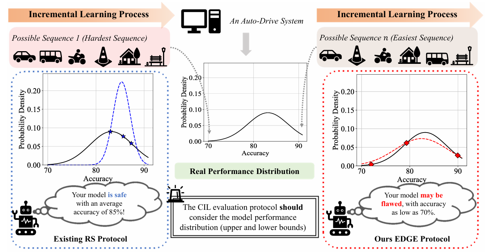
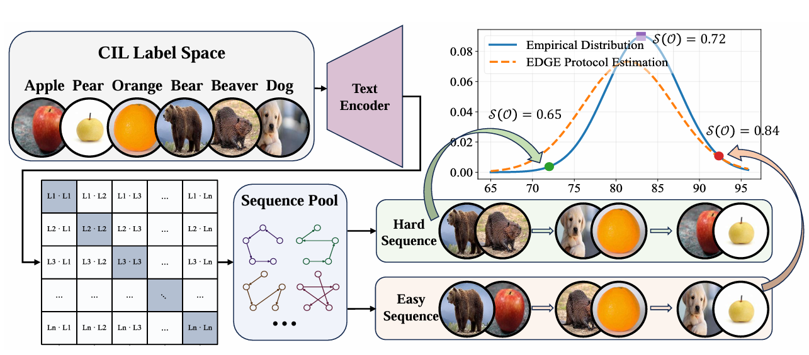

## The Lie of the Average: How Class Incremental Learning Evaluation Deceives You?

---

<p align="center">
  <a href=""></a>
  <a href="https://openreview.net/pdf?id=19LHXi9uLw"></a>
  <a href=""></a>
  <a href=""></a>
  <a href=""></a>
</p>

<p align="center">
  <a href="https://www.lamda.nju.edu.cn/laign/">Guannan Lai</a> ·
  <a href="https://www.lamda.nju.edu.cn/zhoudw/">Da-Wei Zhou</a> ·
  <a href="https://it.swufe.edu.cn/info/1119/2300.htm">Xin Yang</a> ·
  <a href="https://www.lamda.nju.edu.cn/yehj/">Han-Jia Ye</a>
</p>

## 🎉 Introduction

<div align="center">
  
</div>

This repository contains the official implementation of **EDGE** (Extreme case–based Distribution & Generalization Evaluation), an evaluation protocol for **Class-Incremental Learning (CIL)**.

Mainstream CIL evaluation typically reports the *mean* (and sometimes variance) over only a small number of randomly sampled class sequences. However, CIL performance can vary substantially across sequences, and limited sampling may lead to **biased mean estimates** and a **severe underestimation** of the true variance in the performance distribution.

Our paper argues that robust CIL evaluation should characterize the **full performance distribution**, and introduces **extreme sequences** as a principled tool to approximate distributional boundaries efficiently.

## 🧊 EDGE Protocol

<div align="center">
  
</div>

EDGE evaluates a CIL method by estimating not only the central tendency but also the **distributional boundaries** (e.g., near-best / near-worst sequences).

At a high level, EDGE:

1. Computes or estimates **inter-task similarity** between incremental tasks/classes.
2. Uses the similarity signal to **search for extreme sequences**.
3. Samples sequences adaptively to better approximate the **true performance distribution**.

## 📰 What's New

- [2026-01] 🌟 Accepted by **ICLR 2026**
- [2025-10] 🌟 Initial release of EDGE evaluation code
- [2025-10] 🌟 Release arXiv version

## ☄️ How to Use

We integrate **EDGE** into two widely-used CIL toolboxes:
- **PILOT**: https://github.com/LAMDA-CL/LAMDA-PILOT  
- **PyCIL**: https://github.com/LAMDA-CL/PyCIL

This repo contains two subfolders, `PILOT/` and `PyCIL/`. Our main modifications include:
- Updating `main.py` and `trainer.py`
- Adding `utils/edge.py` (EDGE core logic)

EDGE is largely **decoupled** from the core training pipelines of PILOT and PyCIL. Therefore, if PILOT/PyCIL updates in the future, this integration can be adapted with minimal changes.

Concretely, we introduce an `--eval` argument:
- `--eval random`: the standard evaluation protocol using randomly sampled class orders (default in many toolboxes)
- `--eval edge`: the proposed EDGE protocol with similarity-guided extreme-sequence search and adaptive sampling

### 🕹️ Clone

```bash
git clone https://github.com/AIGNLAI/EDGE
cd EDGE
```

### 🗂️ Dependencies

- Python >= 3.8
- PyTorch >= 2.0
- torchvision
- timm
- numpy / scipy
- tqdm

> We recommend using a clean conda environment.

```bash
conda create -n edge python=3.10 -y
conda activate edge

# tested versions (example)
pip install torch==2.0.0+cu118 torchvision==0.15.1+cu118 --extra-index-url https://download.pytorch.org/whl/cu118
pip install git+https://github.com/openai/CLIP.git
pip install scipy
pip install timm==0.6.12
pip install tqdm
```

### 🔑 Run with EDGE

You can run EDGE evaluation by adding `--eval='edge'`:

```bash
python main.py --config=./exps/[MODEL NAME].json --eval='edge'
```

To use the random-sequence baseline:

```bash
python main.py --config=./exps/[MODEL NAME].json --eval='random'
```

## 📚 Citation

If you find this repo useful, please consider citing:

```bibtex
@inproceedings{lai2026lie,
  title     = {The Lie of the Average: How Class Incremental Learning Evaluation Deceives You?},
  author    = {Lai, Guannan and Zhou, Da-Wei and Yang, Xin and Ye, Han-Jia},
  booktitle = {ICLR},
  year      = {2026}
}
```

## 👨‍🏫 Acknowledgments

We thank the following repos/projects for helpful components:

- PILOT
- PyCIL

## 🤗 Contact

For questions and feedback, please open an issue or contact:

- Guannan Lai ([laign@lamda.nju.edu.cn](mailto:laign@lamda.nju.edu.cn))

------

[](https://star-history.com/#AIGNLAI/EDGE&Date)

